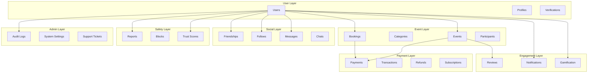
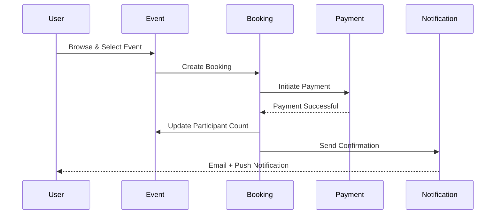
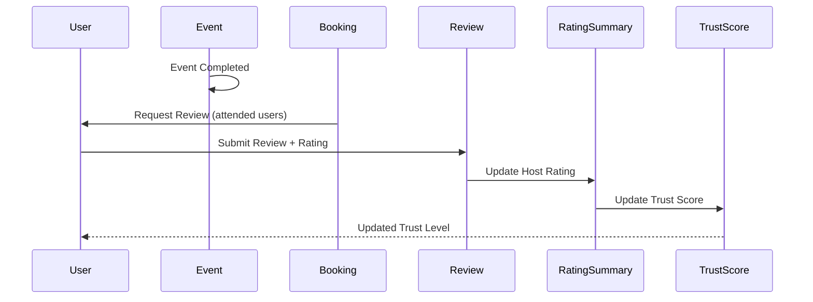
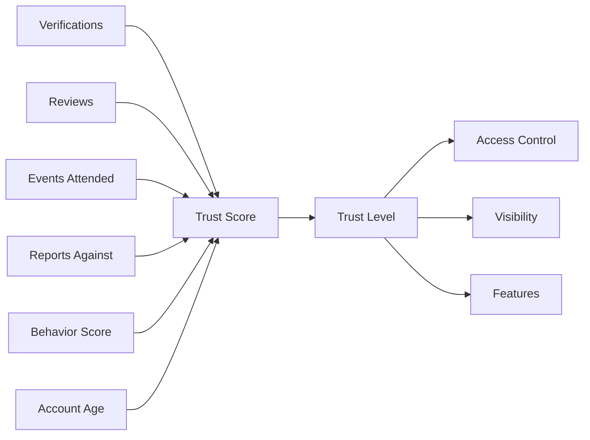
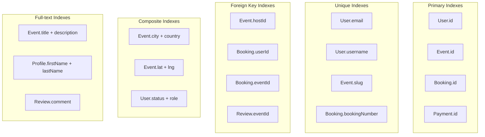
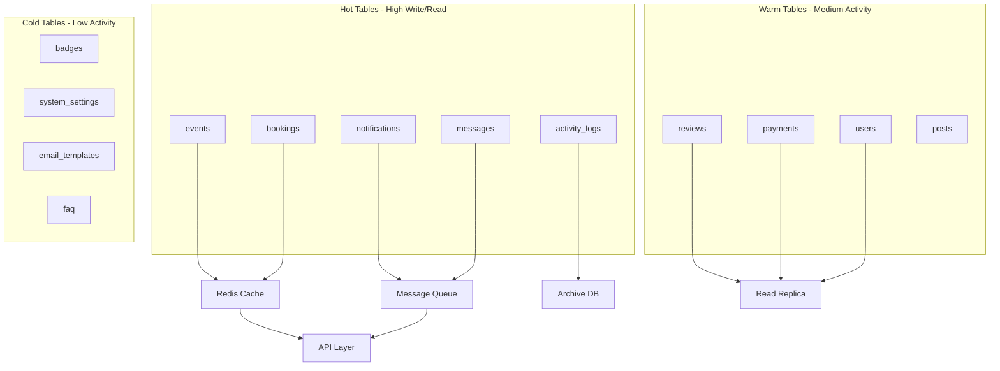

# Database Schema Visualization

## Entity Relationship Diagram (ERD)

```mermaid
erDiagram
    %% ============================================
    %% CORE USER & AUTH
    %% ============================================
    
    User ||--o| Profile : has
    User ||--o{ Verification : has
    User ||--o{ RefreshToken : has
    User ||--o{ LoginHistory : has
    User ||--o| Subscription : has
    User ||--o| NotificationPreference : has
    User ||--o| TrustScore : has
    
    User {
        string id PK
        string email UK
        string username UK
        string password
        enum role
        enum status
        boolean emailVerified
        boolean isVerified
        datetime createdAt
        datetime deletedAt
    }
    
    Profile {
        string id PK
        string userId FK
        string firstName
        string lastName
        string bio
        string avatarUrl
        string city
        string country
        int eventsAttended
        int eventsHosted
        float totalRating
    }
    
    %% ============================================
    %% EVENTS
    %% ============================================
    
    User ||--o{ Event : hosts
    EventCategory ||--o{ Event : contains
    Event ||--o{ Booking : has
    Event ||--o{ EventParticipant : has
    Event ||--o{ Review : receives
    Event ||--o{ SavedEvent : saved-by
    
    Event {
        string id PK
        string title
        string hostId FK
        string categoryId FK
        enum type
        enum status
        datetime startDate
        datetime endDate
        string city
        float price
        int maxParticipants
        int currentParticipants
        datetime createdAt
    }
    
    EventCategory {
        string id PK
        string name UK
        string slug UK
        string icon
        string color
    }
    
    Booking {
        string id PK
        string bookingNumber UK
        string userId FK
        string eventId FK
        enum status
        float totalAmount
        enum paymentStatus
        boolean attended
        datetime createdAt
    }
    
    %% ============================================
    %% PAYMENTS
    %% ============================================
    
    User ||--o{ Payment : makes
    Payment ||--o{ Transaction : generates
    Payment ||--o{ Refund : has
    Booking ||--o| Payment : requires
    
    Payment {
        string id PK
        string userId FK
        string eventId FK
        float amount
        enum status
        enum method
        string gateway
        datetime paidAt
    }
    
    Transaction {
        string id PK
        string userId FK
        string paymentId FK
        enum type
        float amount
        datetime createdAt
    }
    
    Subscription {
        string id PK
        string userId FK
        enum plan
        enum status
        float amount
        datetime currentPeriodStart
        datetime currentPeriodEnd
    }
    
    %% ============================================
    %% SOCIAL
    %% ============================================
    
    User ||--o{ Friendship : "sends/receives"
    User ||--o{ Follow : "follows/followed-by"
    User ||--o{ Message : "sends/receives"
    Chat ||--o{ Message : contains
    Chat ||--o{ ChatParticipant : has
    User ||--o{ ChatParticipant : participates
    
    Friendship {
        string id PK
        string requestorId FK
        string receiverId FK
        enum status
        datetime createdAt
    }
    
    Follow {
        string id PK
        string followerId FK
        string followingId FK
        datetime createdAt
    }
    
    Chat {
        string id PK
        enum type
        string eventId FK
        datetime lastMessageAt
    }
    
    Message {
        string id PK
        string chatId FK
        string senderId FK
        string content
        enum status
        datetime createdAt
    }
    
    %% ============================================
    %% REVIEWS & RATINGS
    %% ============================================
    
    User ||--o{ Review : writes
    User ||--o{ Review : receives
    Event ||--o{ Review : has
    Review ||--o{ CategoryRating : has
    
    Review {
        string id PK
        string authorId FK
        string targetUserId FK
        string eventId FK
        float overallRating
        string comment
        boolean isVerifiedAttendee
        datetime createdAt
    }
    
    CategoryRating {
        string id PK
        string reviewId FK
        enum category
        float rating
    }
    
    %% ============================================
    %% NOTIFICATIONS
    %% ============================================
    
    User ||--o{ Notification : receives
    
    Notification {
        string id PK
        string userId FK
        enum type
        string title
        string message
        boolean isRead
        datetime createdAt
    }
    
    %% ============================================
    %% GAMIFICATION
    %% ============================================
    
    Badge ||--o{ UserBadge : awarded-to
    User ||--o{ UserBadge : earns
    Achievement ||--o{ UserAchievement : tracked-by
    User ||--o{ UserAchievement : achieves
    User ||--o{ UserPoint : earns
    
    Badge {
        string id PK
        string name UK
        string slug UK
        enum type
        enum rarity
        int pointsReward
    }
    
    UserBadge {
        string id PK
        string userId FK
        string badgeId FK
        datetime earnedAt
    }
    
    Achievement {
        string id PK
        string name UK
        string category
        int totalSteps
        int pointsReward
    }
    
    UserPoint {
        string id PK
        string userId FK
        int points
        string reason
        datetime createdAt
    }
    
    %% ============================================
    %% SAFETY & MODERATION
    %% ============================================
    
    User ||--o{ Report : "creates/receives"
    User ||--o{ Block : "blocks/blocked-by"
    
    Report {
        string id PK
        string reporterId FK
        string targetUserId FK
        enum type
        enum status
        string reason
        datetime createdAt
    }
    
    Block {
        string id PK
        string blockerId FK
        string blockedId FK
        datetime createdAt
    }
    
    TrustScore {
        string id PK
        string userId FK
        float score
        enum level
        enum riskLevel
        datetime lastCalculatedAt
    }
    
    %% ============================================
    %% ADMIN & AUDIT
    %% ============================================
    
    User ||--o{ AuditLog : performs
    User ||--o{ ActivityLog : generates
    
    AuditLog {
        string id PK
        string userId FK
        enum action
        enum entityType
        string entityId
        json changes
        datetime createdAt
    }
    
    ActivityLog {
        string id PK
        string userId FK
        string activityType
        string sessionId
        datetime createdAt
    }
```

## Simplified Architecture View

## Data Flow Diagrams

### Event Booking Flow

### Review & Rating Flow

### Trust Score Calculation

## Key Relationships Summary

### One-to-One (1:1)
- User ↔ Profile
- User ↔ Subscription
- User ↔ TrustScore
- User ↔ NotificationPreference
- Booking ↔ Payment

### One-to-Many (1:N)
- User → Events (hosted)
- User → Bookings
- User → Reviews (given)
- User → Notifications
- Event → Bookings
- Event → Reviews
- Chat → Messages

### Many-to-Many (N:M)
- User ↔ User (Friendships via Friendship table)
- User ↔ User (Following via Follow table)
- User ↔ Event (Participation via EventParticipant)
- User ↔ Chat (via ChatParticipant)
- User ↔ Badge (via UserBadge)

## Index Strategy Visualization

## Scaling Considerations

---

**Note:** These diagrams provide a visual overview. Refer to [Schema README](./README.md) for detailed documentation.
